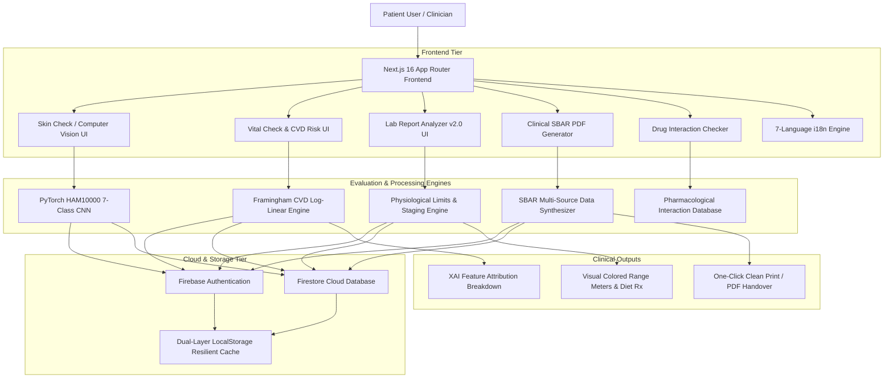

# 🩺 RoboDoctor AI — Intelligent Clinical Health Platform & Computer-Vision Diagnostic Engine

<p align="center">
  
</p>

<p align="center">
  <strong>Predict • Screen • Analyze • Coordinate • Protect</strong>
</p>

<p align="center">
  <a href="https://robodoctor-ai-advanced.vercel.app"></a>
  <a href="https://github.com/Pratyaksh5240/robodoctor-ai-advanced"></a>
  <a href="https://nextjs.org"></a>
  <a href="https://pytorch.org"></a>
  <a href="https://fastapi.tiangolo.com"></a>
  <a href="https://firebase.google.com"></a>
</p>

<p align="center">
  <strong>🌐 Official Live Production:</strong> <a href="https://robodoctor-ai-advanced.vercel.app">https://robodoctor-ai-advanced.vercel.app</a><br/>
  <strong>💻 Source Repository:</strong> <a href="https://github.com/Pratyaksh5240/robodoctor-ai-advanced">https://github.com/Pratyaksh5240/robodoctor-ai-advanced</a>
</p>

---

## 📖 Table of Contents
1. [Executive Overview](#-executive-overview)
2. [End-to-End System Architecture](#-end-to-end-system-architecture)
3. [Core Clinical Modules & Features](#-core-clinical-modules--features)
   - [1. Hybrid Computer-Vision Skin Screening (`/skin-check`)](#1-hybrid-computer-vision-skin-screening-skin-check)
   - [2. AI Vital Check & Continuous Framingham CVD Risk Engine (`/health-check`)](#2-ai-vital-check--continuous-framingham-cvd-risk-engine-health-check)
   - [3. Clinical Lab Report Analyzer v2.0 (`/lab-report`)](#3-clinical-lab-report-analyzer-v20-lab-report)
   - [4. Clinical SBAR PDF Export Engine (`/export-report`)](#4-clinical-sbar-pdf-export-engine-export-report)
   - [5. Multi-Drug Interaction & Safety Checker (`/medicine-checker`)](#5-multi-drug-interaction--safety-checker-medicine-checker)
   - [6. Personalized Nutrition & Diet Planner (`/diet-planner`)](#6-personalized-nutrition--diet-planner-diet-planner)
   - [7. Smart Medicine & Routine Care Reminders (`/medicine-reminder`)](#7-smart-medicine--routine-care-reminders-medicine-reminder)
   - [8. Geolocation Nearby Care & Emergency Discovery (`/nearby-care`)](#8-geolocation-nearby-care--emergency-discovery-nearby-care)
   - [9. Multimodal AI Assistant & Prescription Scanner (`/ai-health-assistant`, `/ai-chatbot`)](#9-multimodal-ai-assistant--prescription-scanner-ai-health-assistant-ai-chatbot)
   - [10. Yoga, Workout & Recovery Search Engine (`/yoga-videos`)](#10-yoga-workout--recovery-search-engine-yoga-videos)
   - [11. Emergency Guide, Red Flags & Contacts (`/emergency-guide`, `/emergency-contacts`, `/first-aid`)](#11-emergency-guide-red-flags--contacts-emergency-guide-emergency-contacts-first-aid)
4. [Technology Stack](#-technology-stack)
5. [Project Directory Structure](#-project-directory-structure)
6. [Local Installation & Setup](#-local-installation--setup)
7. [Environment Configuration](#-environment-configuration)
8. [Testing & Build Verification](#-testing--build-verification)
9. [Clinical Disclaimer & Safety Notice](#-clinical-disclaimer--safety-notice)

---

## 🌟 Executive Overview

**RoboDoctor AI** is a state-of-the-art full-stack digital health platform engineered to bridge the gap between patient self-monitoring, computer-vision triage, clinical laboratory interpretation, and clinical handovers. 

Unlike conventional health apps that provide generic static text, RoboDoctor AI incorporates:
- **Biologically Bound Validation Engines**: Catches typos, out-of-range clinical errors, and improbable values across all test metrics.
- **Continuous Log-Linear Cardiovascular Risk Staging**: Uses clinical Framingham Cox proportional hazards models for exact risk scoring.
- **Dermoscopic Deep Learning**: Trained on 10,015 dermatological images (HAM10000 dataset) with automated blur, lighting, and uncertainty guardrails.
- **Hospital-Standard SBAR PDF Handover Generator**: Formats patient vitals and findings into structured Situation-Background-Assessment-Recommendation documents ready for physician handoff.
- **7-Language Real-Time i18n**: Instant localization across English, Hindi, Spanish, French, German, Chinese, and Korean.
- **Permanent Dark Theme**: High-contrast, WCAG AAA-compliant interface designed for clinical clarity and reduced visual fatigue.

---

## 🏗️ End-to-End System Architecture



---

## 🔬 Core Clinical Modules & Features

### 1. Hybrid Computer-Vision Skin Screening (`/skin-check`)
- **HAM10000 Dataset Integration**: Trained on 10,015 gold-standard dermatological images across 7 clinical disease categories:
  1. `mel`: Melanoma (Critical High Risk)
  2. `nv`: Melanocytic Nevus (Benign Mole)
  3. `bcc`: Basal Cell Carcinoma (Malignant High Risk)
  4. `akiec`: Actinic Keratosis / Bowen's Disease (Pre-malignant)
  5. `bkl`: Benign Keratosis (Seborrheic Keratosis / Solar Lentigo)
  6. `df`: Dermatofibroma (Benign Lesion)
  7. `vasc`: Vascular Lesion (Hemangioma / Angiokeratoma)
- **Pre-Screening Quality Guardrails**: Detects blurred or excessively dark photos before running inference.
- **Uncertainty Rejection**: If the top prediction probability is $< 0.45$, flags the image as ambiguous and requests a clearer, well-lit close-up.
- **Multimodal Symptom Fusion**: Combines lesion visual analysis with symptoms (bleeding, rapid growth, pain, itching, duration $> 2$ weeks) to adjust triage urgency and alert thresholds.

---

### 2. AI Vital Check & Continuous Framingham CVD Risk Engine (`/health-check`)
- **Continuous Log-Linear Framingham CVD Engine** (`lib/framinghamRisk.ts`):
  - Calculates 10-year risk of cardiovascular disease based on age, gender, systolic BP, treated/untreated hypertension status, fasting blood sugar, BMI, and smoking history.
  - Generates exact percentage scores ($1\% - 100\%$) rather than static arbitrary categories.
- **Explainable AI (XAI) Attribution**:
  - Highlights specific positive risk drivers (e.g., elevated systolic blood pressure, high BMI) and protective factors (e.g., youthful age, optimal glucose).
- **Persistent Demographics Sync**:
  - Automatically preserves patient demographics (Age, Biological Gender, BMI, Symptoms) in `lib/reportHistory.ts` so they transfer seamlessly to the clinical PDF report.

---

### 3. Clinical Lab Report Analyzer v2.0 (`/lab-report`)
- **Physiological Bounds & Typo Detection Engine** (`lib/labEvaluator.ts`):
  - Strict human biological survival limits prevent misleading outputs:
    - **Hemoglobin**: Valid $3.0 - 25.0\text{ g/dL}$. Typing **`199`** or **`50`** triggers an instant **`TYPO DETECTED`** alert warning that the value exceeds human physiological limits, prompting the user to check if a decimal point was missed (e.g., `11.9`, `14.9`, or `19.9`).
    - **Fasting Sugar**: Valid $20 - 750\text{ mg/dL}$.
    - **HbA1c**: Valid $3.0 - 22.0\%$.
    - **TSH**: Valid $0.01 - 150\text{ mIU/L}$.
    - **Total Cholesterol**: Valid $50 - 650\text{ mg/dL}$.
    - **Serum Creatinine**: Valid $0.2 - 20.0\text{ mg/dL}$.
    - **Platelet Count**: Valid $5 - 1500 \times 10^3/\mu\text{L}$.
    - **WBC / TLC**: Valid $0.5 - 100 \times 10^3/\mu\text{L}$ (with auto-normalization for raw counts e.g., $7500 \rightarrow 7.5$).
- **Multi-Stage Severity Staging**:
  - Critical Low / Emergency Alert $\rightarrow$ Low / Deficient $\rightarrow$ Optimal Normal $\rightarrow$ Borderline / Elevated $\rightarrow$ Critical High.
- **Biological Sex Toggle**:
  - Instantly toggles between **♂ Adult Male** ($13.8 - 17.5\text{ g/dL}$) and **♀ Adult Female** ($12.0 - 15.5\text{ g/dL}$) reference standards.
- **Visual Range Meters**:
  - Segmented multi-zone color bar with an animated indicator pin showing exactly where patient values fall.
- **One-Click Clinical Presets**:
  - 🌟 Healthy Routine Checkup
  - 🩸 Iron Deficiency Anemia (Hb 8.4)
  - ⚠️ High Hemoglobin / Polycythemia (Hb 19.4)
  - 🍬 Uncontrolled Diabetes Pattern (Sugar 188, HbA1c 8.9)
  - 🦋 Hypothyroid Pattern (TSH 13.8)
  - ❌ Typo Test (Hb 199, Sugar 999)
- **Persist & Export**:
  - Save lab results to user history or copy clean formatted summaries for medical consults.

---

### 4. Clinical SBAR PDF Export Engine (`/export-report`)
- **Hospital-Standard SBAR Protocol**:
  - **S (Situation)**: Primary complaint, urgent flags, triage urgency level.
  - **B (Background)**: Patient demographics, age, biological gender, chronicity, lifestyle factors.
  - **A (Assessment)**: Detailed vital signs, laboratory metrics, dermoscopic findings, and risk staging.
  - **R (Recommendation)**: Suggested specialist referrals, diagnostic follow-ups, lifestyle interventions.
- **3-Way Report Isolation Mode**:
  - 💓 **Vitals Only**: Clinical report focusing strictly on Framingham cardiovascular risk and vital statistics.
  - 🔬 **Skin Only**: Dermatological report focusing on lesion computer vision analysis and symptom timeline.
  - 📑 **Combined**: Comprehensive general patient handover integrating both vitals and dermatology.
- **Print & PDF Optimization**:
  - Styled with clean, ink-friendly `@media print` CSS rules for instant browser-to-PDF saving without UI artifacts.

---

### 5. Multi-Drug Interaction & Safety Checker (`/medicine-checker`)
- **Drug-Drug Interaction Analysis**: Analyzes dangerous medication pairs (e.g., Warfarin + Aspirin, Metformin + Contrast, ACE Inhibitors + Spironolactone).
- **Mechanism & Warning Signs**: Explains *why* the combination is risky, what physical symptoms to watch for (bruising, hypotension, arrhythmia), and specific timing/administration separation rules.
- **Food & Beverage Alerts**: Highlights interactions with grapefruit juice, alcohol, dairy, and high-sodium meals.

---

### 6. Personalized Nutrition & Diet Planner (`/diet-planner`)
- **Targeted Dietary Frameworks**:
  - **Sugar Stabilization**: Low-glycemic index foods, Plate Method ($50\%$ non-starchy veg, $25\%$ lean protein, $25\%$ complex carbs).
  - **DASH / Heart Health**: Sodium restriction, high potassium, magnesium, and soluble fiber.
  - **Renal Protection**: Moderate protein, controlled potassium and sodium, adequate hydration without nephrotoxic load.
  - **Iron Deficiency Anemia**: High-iron plant and animal sources paired with Vitamin C (lemon/oranges) and tea/coffee timing buffers.

---

### 7. Smart Medicine & Routine Care Reminders (`/medicine-reminder`)
- Schedule and track medications, dosage times, water intake, daily exercise, and routine blood glucose checks.
- Browser notification support and calendar integration.

---

### 8. Geolocation Nearby Care & Emergency Discovery (`/nearby-care`)
- Browser GPS integration with Google Maps API.
- Instant 1-click filtering for:
  - 🏥 Hospitals & Emergency Trauma Centers
  - 🩺 Urgent Care Clinics
  - 💊 24/7 Pharmacies
  - 🚑 Diagnostic Labs & Pathologies

---

### 9. Multimodal AI Assistant & Prescription Scanner (`/ai-health-assistant`, `/ai-chatbot`)
- **Gemini Vision Integration**: Upload doctor prescriptions or diagnostic reports to extract drug names, dosages, frequencies, and cautionary instructions.
- **Conversational Health Assistant**: Multilingual interactive triage answering patient queries while upholding medical safety boundaries.

---

### 10. Yoga, Workout & Recovery Search Engine (`/yoga-videos`)
- Query-driven video engine supporting keywords like `"pushup"`, `"abs"`, `"back pain"`, `"weight loss"`, `"cardio"`, `"sleep"`.
- 100% verified, embeddable YouTube instructional tutorials.

---

### 11. Emergency Guide, Red Flags & Contacts (`/emergency-guide`, `/emergency-contacts`, `/first-aid`)
- Triage decision trees for chest pain, stroke symptoms (FAST), respiratory distress, and head trauma.
- Rapid emergency hotline dials (Ambulance, Police, National Emergency Services).
- Illustrated step-by-step first-aid protocols for burns, bleeding, choking, and fractures.

---

## 🛠️ Technology Stack

| Layer | Technologies |
| :--- | :--- |
| **Frontend Framework** | **Next.js 16** (App Router, Turbopack Engine), **React 19** |
| **Language & Typings** | **TypeScript 5.x** (Strict Mode Enabled) |
| **Styling & UI** | **Tailwind CSS**, Permanent Dark Mode, Lucide Icons |
| **Computer Vision ML** | **PyTorch**, Torchvision, OpenCV, Scikit-Learn |
| **ML Serving** | **FastAPI**, Uvicorn, ASGI Server |
| **Cardiovascular Engine**| Custom Framingham Log-Linear Cox Model (`lib/framinghamRisk.ts`) |
| **Clinical Lab Engine** | Physiological Bounds & Staging Engine (`lib/labEvaluator.ts`) |
| **Authentication & DB**| **Firebase Auth**, **Google Cloud Firestore** |
| **Offline Resilience** | Dual-tier Firestore cloud write + LocalStorage caching |
| **Cloud Hosting** | **Vercel** (Global Edge Network) |

---

## 📁 Project Directory Structure

```
robodoctor-ai/
├── app/                              # Next.js 16 App Router Pages
│   ├── layout.tsx                    # Root layout with i18n & Theme providers
│   ├── page.tsx                      # Modern Landing Dashboard
│   ├── health-check/                 # Vital Check & Continuous Framingham CVD Risk
│   ├── lab-report/                   # Lab Report Analyzer v2.0 (Bounds, Typo Alert, Gauges)
│   ├── export-report/                # Hospital SBAR PDF Export Engine
│   ├── skin-check/                   # Computer Vision Dermoscopic Screening
│   ├── medicine-checker/             # Drug-Drug Interaction Checker
│   ├── diet-planner/                 # Dynamic Nutrition & Meal Protocols
│   ├── medicine-reminder/            # Smart Reminders & Scheduling
│   ├── nearby-care/                  # Geolocation Emergency & Clinic Finder
│   ├── ai-chatbot/                   # AI Conversational Triage
│   ├── ai-health-assistant/          # Multimodal Gemini Assistant & Prescription Scanner
│   ├── yoga-videos/                  # Searchable Yoga & Recovery Video Engine
│   ├── emergency-guide/              # Critical Triage & Red-Flag Protocol
│   ├── emergency-contacts/           # Rapid Emergency Dials
│   ├── first-aid/                    # Emergency First-Aid Step-by-Step
│   └── reports/                      # Patient Medical Report History Dashboard
├── components/                       # Shared UI Components
│   ├── LanguageSwitcher.tsx          # 7-Language Selector
│   ├── MedicalDisclaimer.tsx         # Clinical Safety Notice Banner
│   ├── Navbar.tsx                    # Top Navigation Bar
│   └── ThemeToggle.tsx               # Theme Controls
├── lib/                              # Core Clinical & Algorithmic Engines
│   ├── framinghamRisk.ts             # Framingham 10-year CVD Log-Linear Engine
│   ├── labEvaluator.ts               # Clinical Staging & Physiological Bounds Evaluator
│   ├── reportGenerator.ts            # SBAR Synthesis & Report Transformer
│   ├── reportHistory.ts              # Resilient Local + Firestore Data Persistence
│   ├── skinAnalysis.ts               # Symptom-Lesion Fusion Rules
│   ├── drugInteractions.ts           # Pharmacological Interaction Knowledge Base
│   ├── firebase.ts                   # Firebase Client Initializer
│   └── uiI18n.ts                     # Multilingual Dictionary (EN, HI, ES, FR, DE, ZH, KO)
├── ml/                               # Machine Learning & Computer Vision Backend
│   ├── api/                          # FastAPI REST Endpoints
│   │   └── main.py                   # PyTorch HAM10000 Inference Route
│   ├── models/                       # Model Architecture & Checkpoints
│   └── utils/                        # Image Pre-screening & Quality Checkers
└── public/                           # Static Assets, Icons, and Manifest
```

---

## 💻 Local Installation & Setup

### Prerequisites
- **Node.js**: Version 18.18.0 or newer (Node 20+ recommended)
- **Python**: Version 3.10 to 3.13 (for optional ML backend)
- **Git**

### Step 1: Clone the Repository
```bash
git clone https://github.com/Pratyaksh5240/robodoctor-ai-advanced.git
cd robodoctor-ai-advanced/robodoctor-ai
```

### Step 2: Install Node Dependencies
```bash
npm install
```

### Step 3: Run Next.js Development Server
```bash
npm run dev
```
Open [http://localhost:3000](http://localhost:3000) in your browser.

### Step 4 (Optional): Start FastAPI ML Computer-Vision Backend
If you wish to run the local PyTorch HAM10000 inference backend:
```bash
cd ../ml
python -m venv venv
# On Windows:
.\venv\Scripts\activate
# On macOS/Linux:
source venv/bin/activate

pip install -r requirements.txt
uvicorn api.main:app --host 127.0.0.1 --port 8000 --reload
```
Interactive Swagger API documentation will be available at [http://127.0.0.1:8000/docs](http://127.0.0.1:8000/docs).

---

## 🔐 Environment Configuration

Create a `.env.local` file in `robodoctor-ai/`:

```env
# Firebase Cloud Configuration
NEXT_PUBLIC_FIREBASE_API_KEY="your_firebase_api_key"
NEXT_PUBLIC_FIREBASE_AUTH_DOMAIN="your_project.firebaseapp.com"
NEXT_PUBLIC_FIREBASE_PROJECT_ID="your_project_id"
NEXT_PUBLIC_FIREBASE_STORAGE_BUCKET="your_project.appspot.com"
NEXT_PUBLIC_FIREBASE_MESSAGING_SENDER_ID="your_sender_id"
NEXT_PUBLIC_FIREBASE_APP_ID="your_app_id"

# Google Gemini Vision & AI Assistant
GEMINI_API_KEY="your_gemini_api_key"

# Python ML Endpoint (if running local or remote FastAPI)
NEXT_PUBLIC_ML_API_URL="http://127.0.0.1:8000"
```

---

## 🧪 Testing & Build Verification

The repository is configured for strict type safety and zero-warning production builds:

```bash
# Verify TypeScript Typings
npx tsc --noEmit

# Run Next.js Production Build
npm run build
```

Both tests pass with **0 errors**.

---

## ⚖️ Clinical Disclaimer & Safety Notice

> ⚠️ **IMPORTANT CLINICAL NOTICE:**  
> **RoboDoctor AI** is an assistive health platform developed for educational, preliminary screening, and healthcare coordination purposes only.  
> - It does **NOT** provide a definitive medical diagnosis.  
> - It does **NOT** replace the clinical judgment of a licensed physician, dermatologist, or cardiologist.  
> - If you or someone around you is experiencing acute chest tightness, radiating pain, sudden numbness, difficulty speaking, severe breathing distress, or heavy bleeding, **call your local emergency medical services immediately (e.g. 911 / 112 / 108)** or proceed to the nearest hospital emergency department.

---

## 👨‍💻 Author & Acknowledgments

- **Lead Developer**: [Pratyaksh Soni](https://github.com/Pratyaksh5240)
- **Dermoscopic Dataset**: HAM10000 / ISIC 2018 Challenge (Tschandl et al., *The HAM10000 dataset, a large collection of multi-source dermatoscopic images of common pigmented skin lesions*, Sci. Data 5:180161, 2018).
- **Cardiovascular Models**: Framingham Heart Study 10-Year CVD Risk Score (D'Agostino et al., *Circulation*, 2008).
